<p align="right">
  English | <a href="./README.md">中文</a>
</p>

<p align="right">
  <a href="https://maven.x-humanoid-cloud.com/repository/pnpm-hosted/">
    
  </a>
  <a href="./LICENSE">
    
  </a>
  <a href="https://vuejs.org">
    
  </a>
  <a href="https://maplibre.org">
    
  </a>
</p>

<h1 align="center">BicMap | <a href="https://bicmap.x-humanoid-cloud.com/">Documentation</a></h1>

<h5 align="center">Seamless indoor/outdoor GPU map rendering & interaction SDK · Built for robotics</h5>

[](http://localhost:5173/)

BicMap (`@x-humanoid-cloud/bic-map`) is a WebGL-based map rendering library built on top of [MapLibre GL](https://maplibre.org), [Three.js](https://threejs.org), and [Turf](https://turfjs.org), extended with robotics-oriented features including **indoor SLAM maps, outdoor tile/HD maps, point clouds, 3D models, POI markers, drawing tools, path planning, and robot orchestration** — all ready to use out of the box.

BicMap maps **data** (GeoJSON / point clouds / robot poses) to a set of composable **layers and overlays**. Developers can build seamless indoor/outdoor visualization scenes through a single `bicMap` instance without worrying about engine initialization, coordinate transformations, or asset hosting.

Key Features:

* **Unified indoor/outdoor rendering** — SLAM grid maps, tile base maps, HD maps, 2D/3D point clouds, and 3D models in the same scene
* **Rich overlay types** — direction markers, batch POIs, robot markers, rectangles, polygons, circles, polylines, and wide line segments
* **Interactive drawing** — rectangles, polygons, polylines, circles, and traversable-area drawing & editing
* **Robotics capabilities** — pose tracking, relocalization, real-time positioning, path planning & playback, task orchestration
* **Zero-config engine** — `maplibre-gl` / `three` / `@turf/turf` / `urdf-loader` bundled via npm, CSS and fonts injected at runtime automatically

## Installation

### NPM Module

```bash
# .npmrc
@x-humanoid-cloud:registry=https://maven.x-humanoid-cloud.com/repository/pnpm-hosted/
```

```bash
pnpm add @x-humanoid-cloud/bic-map
```

```js
import bicMap from '@x-humanoid-cloud/bic-map'

await bicMap.init()

const map = bicMap.createMap({
  container: 'map',
  center: [116.397, 39.908],
  zoom: 16
})
```

Use as a Vue plugin (accessible via `this.$bicMap`):

```js
import { createApp } from 'vue'
import bicMap from '@x-humanoid-cloud/bic-map'
import App from './App.vue'

createApp(App).use(bicMap).mount('#app')
```

### Script Tag / CDN

For environments without a build step (uniapp renderJS, plain `<script>` tags, etc.), access via `window.bicMap` after loading:

```html
<script src="https://your-cdn/bicMap.ext.min.js"></script>
<script>
  bicMap.init().then(() => {
    const map = bicMap.createMap({ container: 'map' })
  })
</script>
```

## Feature Gallery

| | | |
| :---: | :---: | :---: |
| 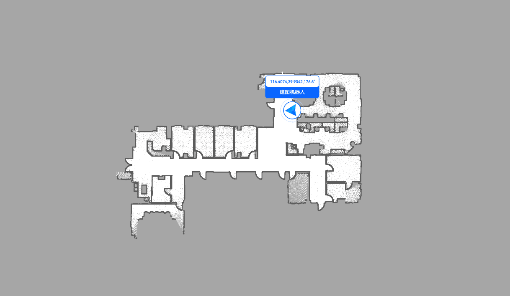<br/>Robot Mapping | 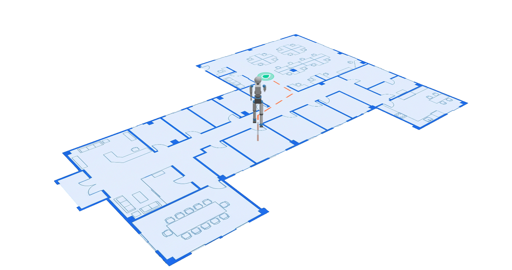<br/>3D Model Control | 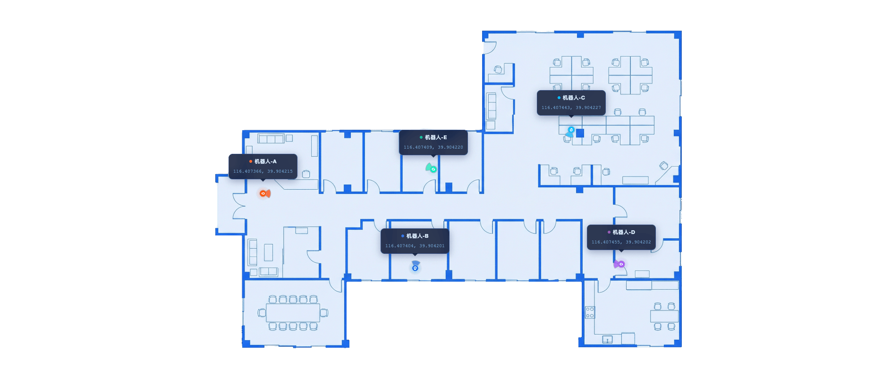<br/>Real-time Location |
| 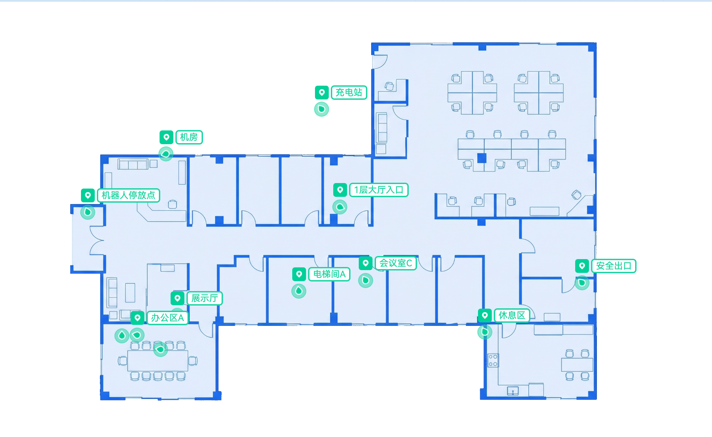<br/>POI Markers | 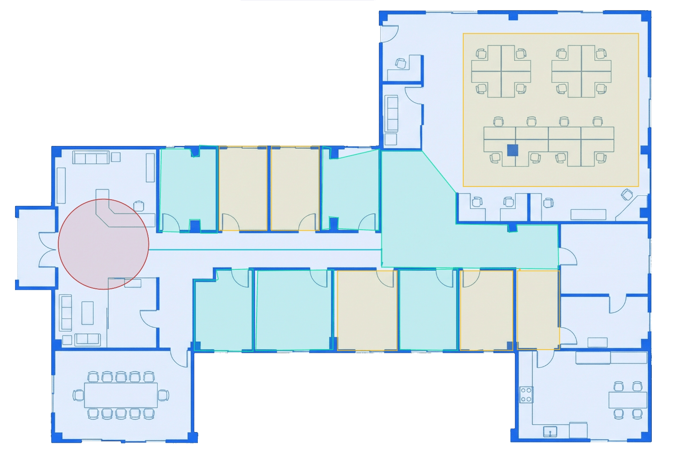<br/>Graphic Drawing | 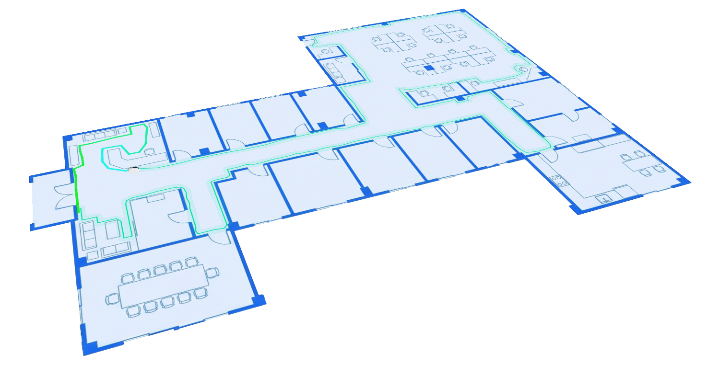<br/>Cleaning Robot Scene |
| 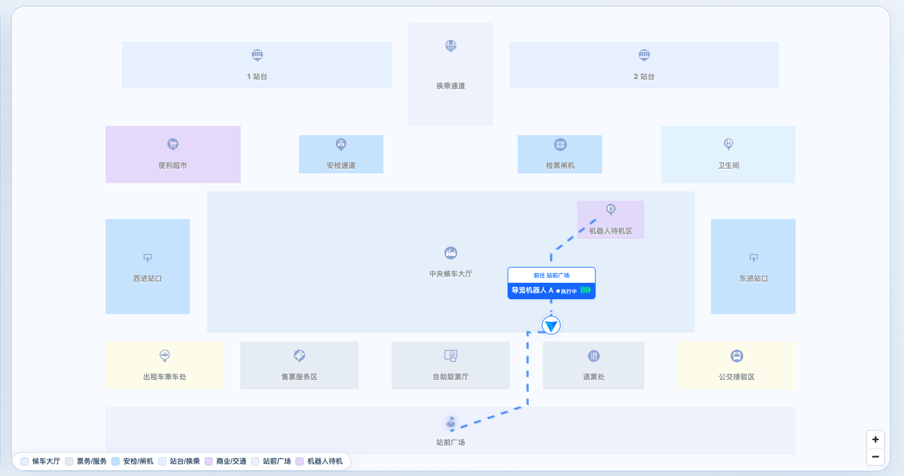<br/>Transit Hub Map Guide | 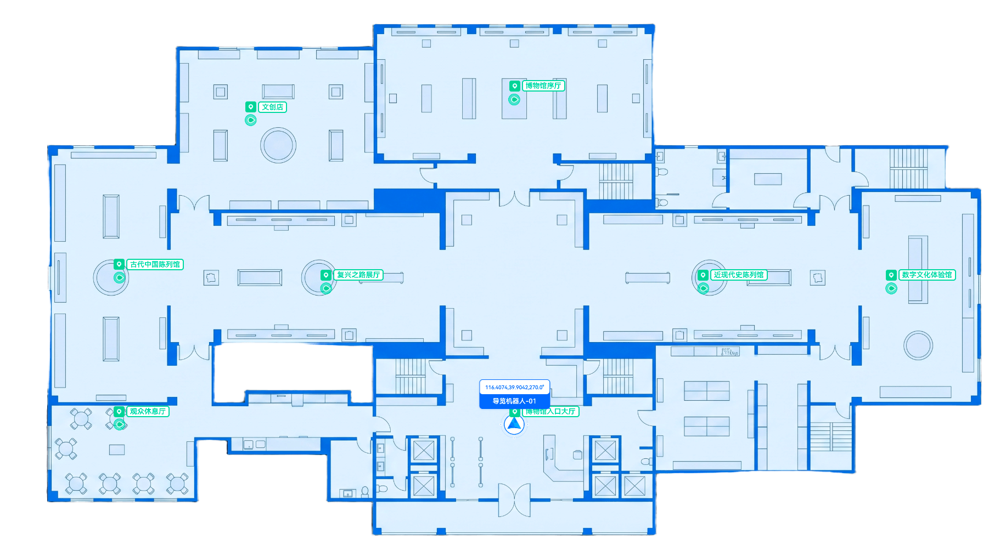<br/>Museum Tour Guide | 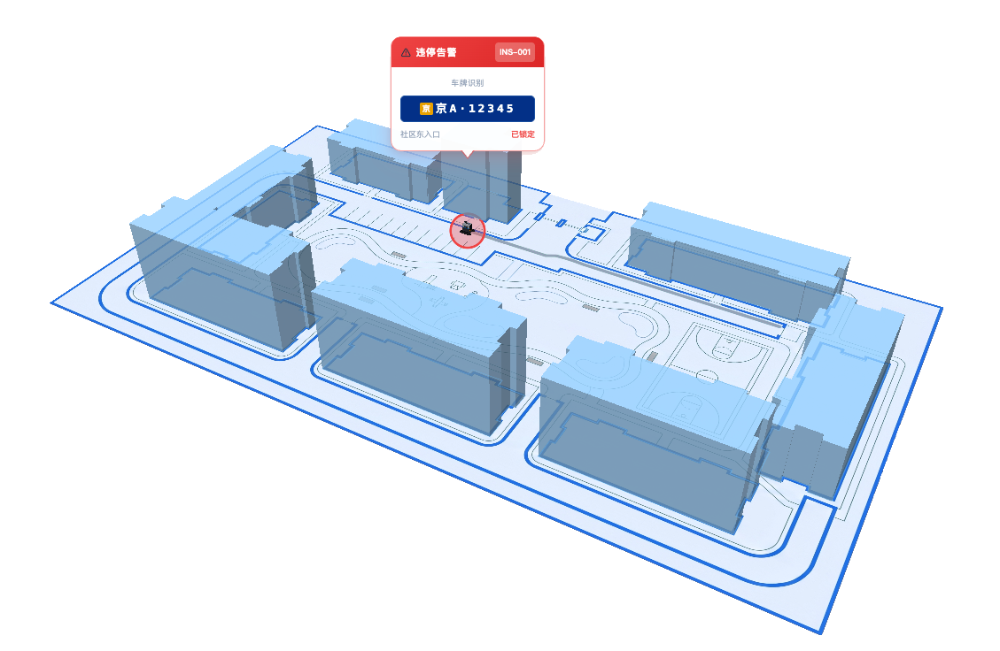<br/>Community 24h Inspection |
| 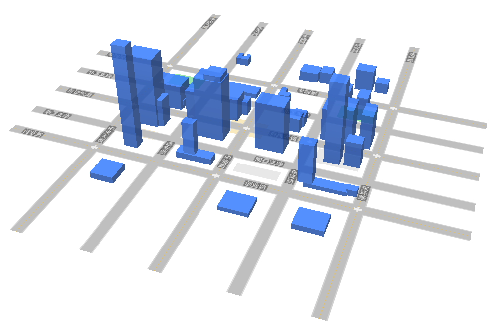<br/>Outdoor Buildings | 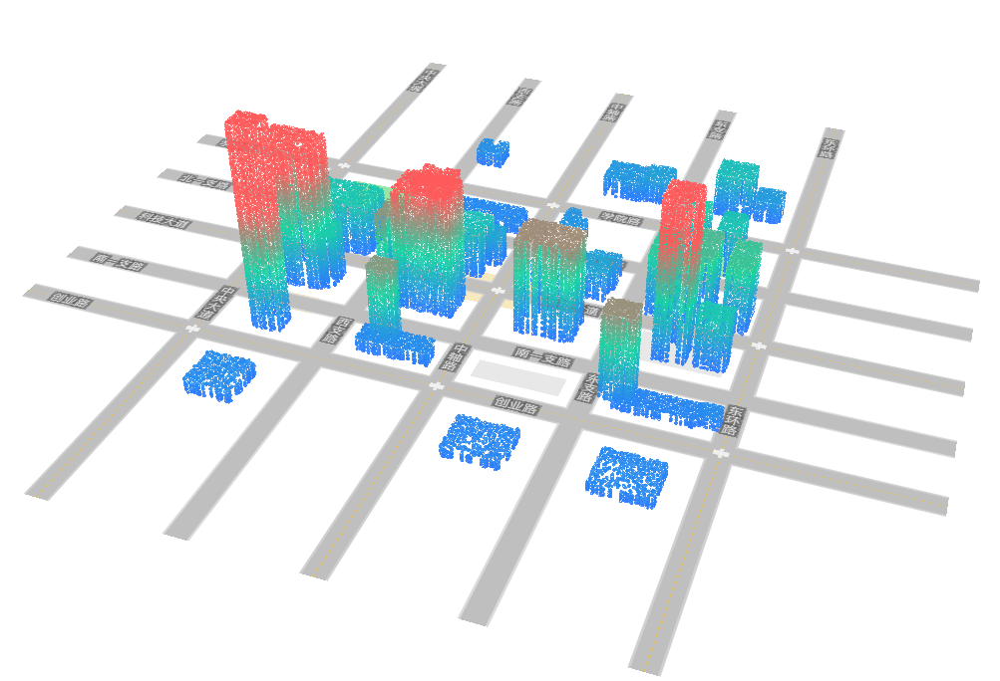<br/>Outdoor Point Cloud | <br/>HD Map Loading |

<p align="right"><a href="https://bicmap.x-humanoid-cloud.com/">View more examples →</a></p>

## Local Development & Examples

The repository includes a built-in example portal covering 30+ examples across indoor / outdoor / basic / extended / scene categories:

```bash
pnpm install
pnpm dev            # Start the example portal at http://localhost:5173/
```

Build commands:

```bash
pnpm build          # Build npm package (ESM + UMD), third-party deps external
pnpm build:cdn      # Build CDN version (IIFE self-contained single file)
pnpm build:web      # Build example portal static site
pnpm build:all      # Build both npm package and CDN version
```

## Resources

* [Online API Docs](http://localhost:5173/) — Example portal and latest API reference
* [Example Portal](http://localhost:5173/) — Interactive preview of all examples; click any card to open the corresponding demo

## Tech Stack

BicMap is built on top of the following open-source projects:

* [MapLibre GL JS](https://maplibre.org) — Core map rendering engine
* [Three.js](https://threejs.org) — 3D model and custom layer rendering
* [Turf.js](https://turfjs.org) — Geospatial computation
* [Vue 3](https://vuejs.org) + [Vite](https://vite.dev) — Example portal and build toolchain
* [urdf-loader](https://github.com/gkjohnson/urdf-loaders) — URDF robot model loading

## Contributors

Thanks to the following developers for their contributions to BicMap:

<table>
  <tr>
    <td align="center">
      <a href="https://github.com/JMSChen">
        
        <br/>
        <sub><b>JMSChen</b></sub>
      </a>
    </td>
    <td align="center">
      <a href="https://github.com/lxycreate">
        
        <br/>
        <sub><b>lxycreate</b></sub>
      </a>
    </td>
  </tr>
</table>

## License

[MIT](./LICENSE) © 2024-2026 Beijing Innovation Center of Humanoid Robotics

This project bundles and redistributes several third-party open-source libraries. Their copyright and license notices are listed in [THIRD-PARTY-LICENSES.md](./THIRD-PARTY-LICENSES.md).
