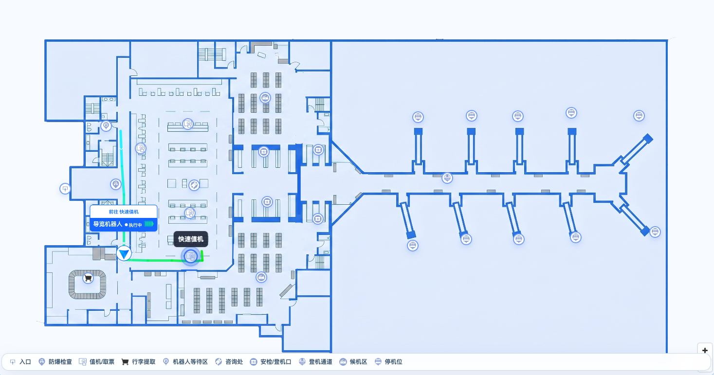
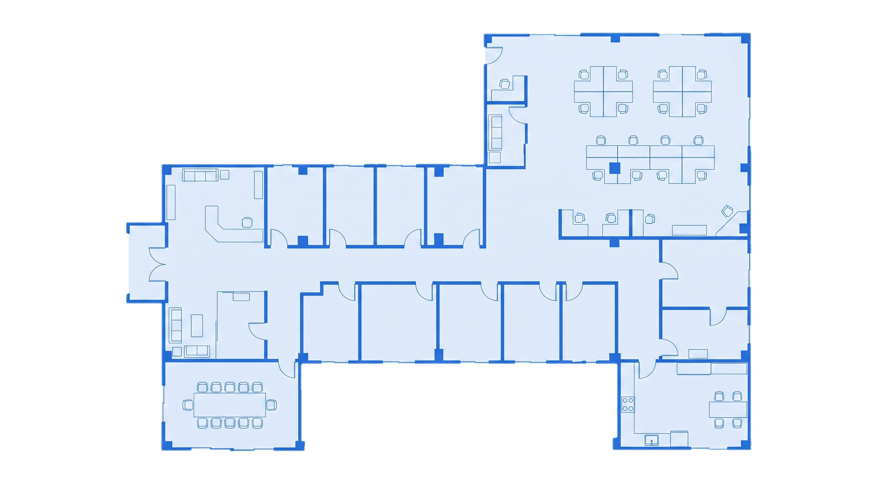
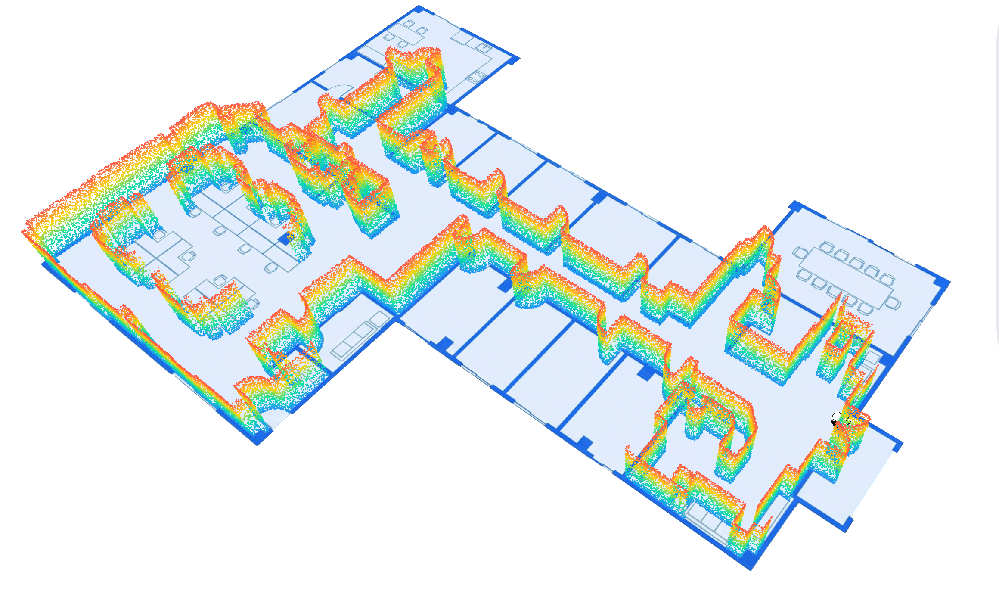
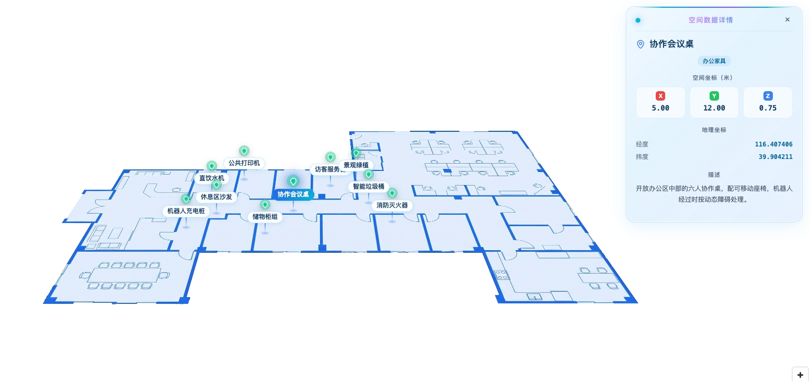
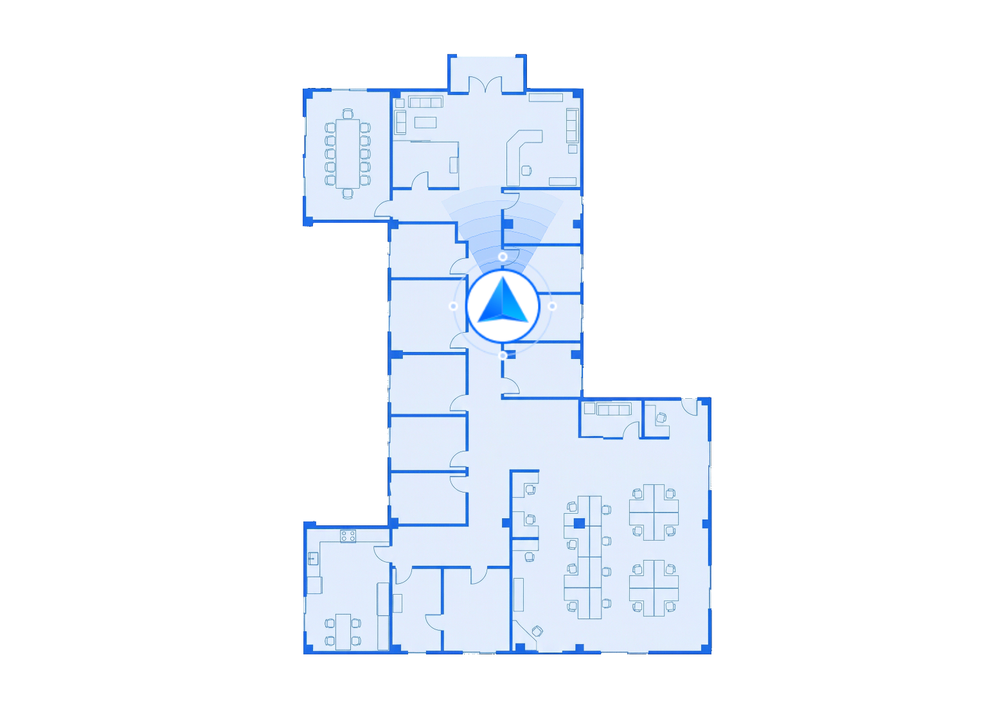
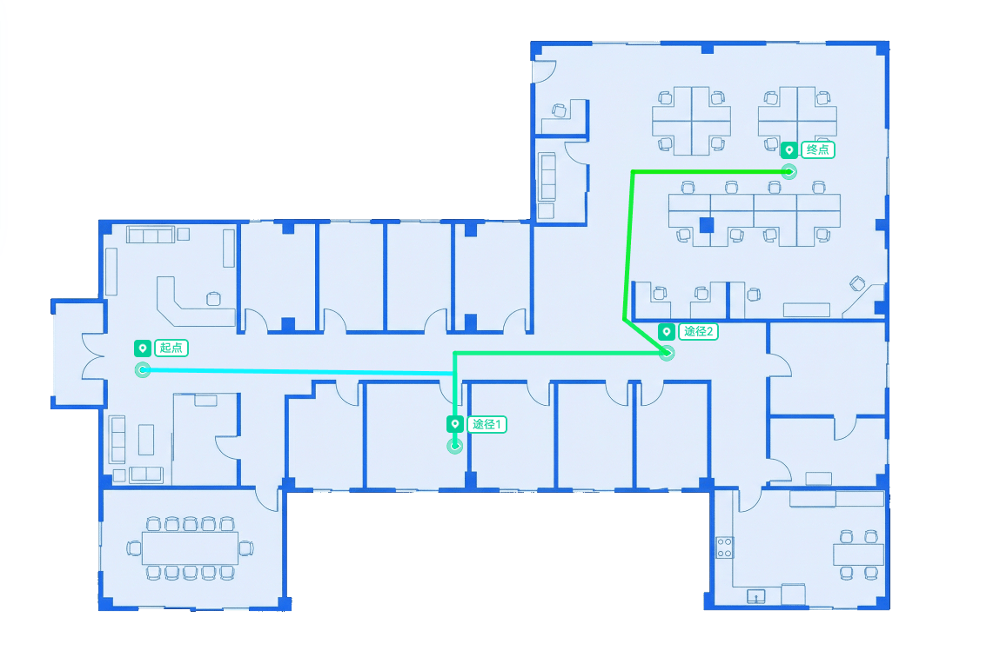
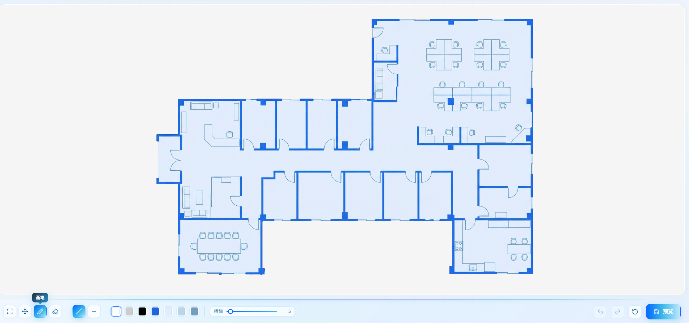
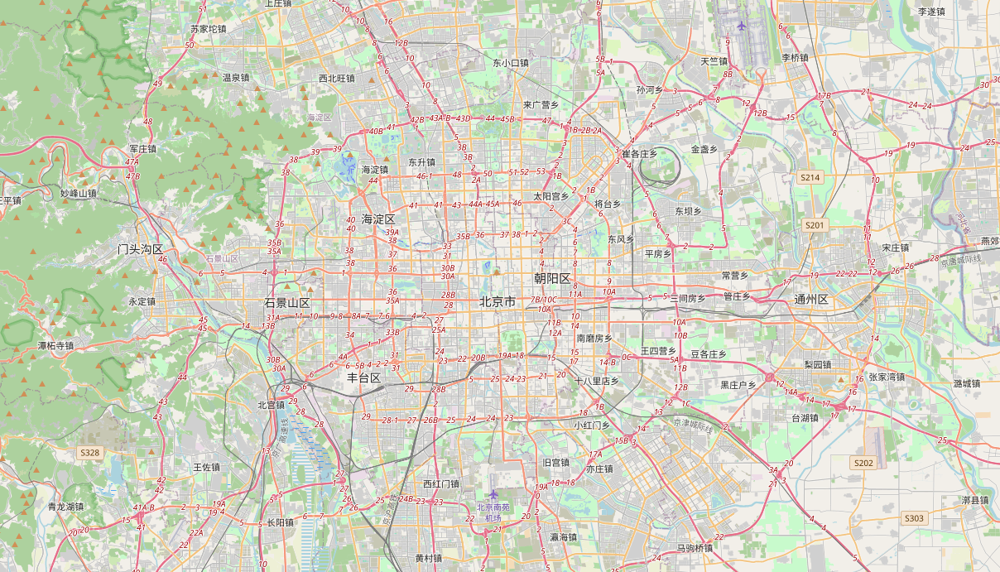
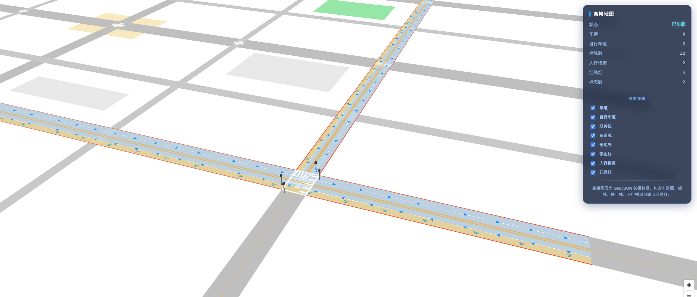
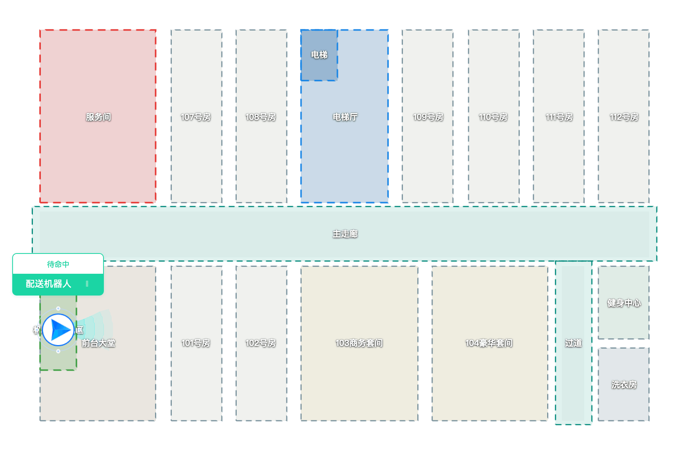

<p align="right">
  <a href="https://maven.x-humanoid-cloud.com/repository/pnpm-hosted/">
    
  </a>
  <a href="./LICENSE">
    
  </a>
  <a href="https://vuejs.org">
    
  </a>
  <a href="https://maplibre.org">
    
  </a>
</p>

<h1 align="center">BicMap | <a href="https://bicmap.x-humanoid-cloud.com/">在线文档</a></h1>

<h5 align="center">室内外一体化的 GPU 地图渲染与交互解决方案 · 面向机器人场景</h5>

[](http://localhost:5173/)

BicMap（`@x-humanoid-cloud/bic-map`）是一套基于 WebGL 的地图渲染库，在 [MapLibre GL](https://maplibre.org) + [Three.js](https://threejs.org) + [Turf](https://turfjs.org) 之上做了面向机器人业务的二次封装，提供 **室内 SLAM 地图、室外瓦片/高精地图、点云、3D 模型、POI 标注、绘制工具、路径规划与机器人编排** 等开箱即用的能力。

BicMap 将 **数据**（GeoJSON / 点云 / 机器人位姿）映射为一组可组合的 **图层与覆盖物**，开发者通过统一的 `bicMap` 单例即可快速搭建室内外一体化的可视化场景，无需关心底层引擎的加载、坐标转换与资源托管细节。

核心特性：

* 室内外一体化：SLAM 栅格地图、瓦片底图、高精地图、二三维点云、3D 模型同场景渲染
* 丰富的覆盖物：方向标记、批量 POI、机器人标记、矩形/多边形/圆形/折线/宽线段
* 交互式绘制：矩形、多边形、折线、圆形、可通行区域绘制与编辑
* 机器人能力：位姿跟随、重定位、实时定位、路径规划与回放、任务编排
* 引擎内置：`maplibre-gl` / `three` / `@turf/turf` 通过 npm 静态打包，CSS 与字体运行时自动注入，零额外配置

## 安装方式

### NPM Module

BicMap 发布在企业私有仓库，安装前需配置对应 registry：

```bash
# .npmrc
@x-humanoid-cloud:registry=https://maven.x-humanoid-cloud.com/repository/pnpm-hosted/
```

```bash
pnpm add @x-humanoid-cloud/bic-map
```

```js
import bicMap from '@x-humanoid-cloud/bic-map'

await bicMap.init()

const map = bicMap.createMap({
  container: 'map',
  center: [116.397, 39.908],
  zoom: 16
})
```

作为 Vue 插件使用（可通过 `this.$bicMap` 访问）：

```js
import { createApp } from 'vue'
import bicMap from '@x-humanoid-cloud/bic-map'
import App from './App.vue'

createApp(App).use(bicMap).mount('#app')
```

### Script Tag / CDN

适配 uniapp renderJS、`<script>` 直引等无构建环境，加载后通过 `window.bicMap` 使用：

```html
<script src="https://your-cdn/bicMap.ext.min.js"></script>
<script>
  bicMap.init().then(() => {
    const map = bicMap.createMap({ container: 'map' })
  })
</script>
```

## 能力速览

| | | |
| :---: | :---: | :---: |
| <br/>室内 SLAM 地图 | <br/>二三维点云 | <br/>3D 空间数据 |
| <br/>机器人视角跟随 | <br/>路径规划 | <br/>地图编辑 |
| <br/>室外瓦片底图 | <br/>高精地图 | <br/>机器人场景案例 |

## 本地开发与示例

仓库内置了一套示例门户，覆盖室内/室外/基础/扩展/场景共 30+ 个示例：

```bash
pnpm install
pnpm dev            # 启动示例门户，默认 http://localhost:5173/
```

构建命令：

```bash
pnpm build          # 构建 npm 包（ESM + UMD），第三方依赖 external
pnpm build:cdn      # 构建 CDN 版本（IIFE 自包含单文件）
pnpm build:web      # 构建示例门户静态站点
pnpm build:all      # 同时构建 npm 包与 CDN 版本
```

## 学习资源

* [在线 API 文档](http://localhost:5173/)：示例门户与最新接口说明
* [示例门户](http://localhost:5173/)：所有示例的可交互预览，点击卡片即可打开对应示例

## 技术栈

BicMap 构建于以下开源项目之上：

* [MapLibre GL JS](https://maplibre.org) — 底层地图渲染引擎
* [Three.js](https://threejs.org) — 3D 模型与自定义图层渲染
* [Turf.js](https://turfjs.org) — 地理空间计算
* [Vue 3](https://vuejs.org) + [Vite](https://vite.dev) — 示例门户与构建工具链

## License

[MIT](./LICENSE) © 2024-2026 北京人形机器人创新中心 (Beijing Innovation Center of Humanoid Robotics)

本项目打包并再分发了若干第三方开源库，其版权与许可证声明见 [THIRD-PARTY-LICENSES.md](./THIRD-PARTY-LICENSES.md)。
