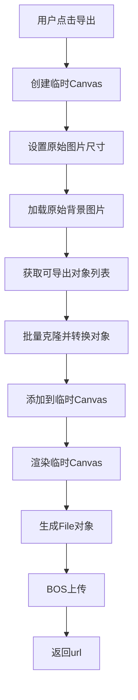

# 图片编辑器 - 图片引入与导出设计文档

## 概述

本文档详细介绍了基于 Fabric.js 6.7 构建的图片编辑器中图片引入、宽高适配和Canvas导出的设计思路和实现方案。该编辑器通过 WorkspacePlugin 插件实现了完整的图片处理工作流。

## 一、图片引入及宽高适配设计

### 1.1 总体设计思路

图片编辑器采用**容器自适应 + 图片居中缩放**的设计模式：

- **容器优先**: Canvas尺寸始终等于父容器尺寸
- **比例保持**: 背景图片保持原始宽高比，自适应缩放
- **居中显示**: 图片在容器中居中显示，确保最佳视觉效果
- **边界限制**: 所有编辑操作限制在背景图片范围内

### 1.2 图片加载流程

#### 步骤1: 容器尺寸获取
```javascript
// 获取父容器尺寸
const containerWidth = this.workspaceEl.offsetWidth;
const containerHeight = this.workspaceEl.offsetHeight;

// 设置Canvas尺寸为容器尺寸
this.canvas.setWidth(containerWidth);
this.canvas.setHeight(containerHeight);
```

#### 步骤2: 图片异步加载
```javascript
fabric.FabricImage.fromURL(image, {
  crossOrigin: "anonymous",
}).then((fabricImage) => {
  const imageWidth = fabricImage.width;
  const imageHeight = fabricImage.height;
  // 后续处理...
});
```

#### 步骤3: 宽高比计算
```javascript
const imageAspectRatio = imageWidth / imageHeight;
const containerAspectRatio = containerWidth / containerHeight;

let displayWidth, displayHeight, scaleX, scaleY, left, top;

if (imageAspectRatio > containerAspectRatio) {
  // 图片比容器更宽，以容器宽度为准
  displayWidth = containerWidth;
  displayHeight = containerWidth / imageAspectRatio;
  left = 0;
  top = (containerHeight - displayHeight) / 2; // 垂直居中
} else {
  // 图片比容器更高，以容器高度为准
  displayHeight = containerHeight;
  displayWidth = containerHeight * imageAspectRatio;
  left = (containerWidth - displayWidth) / 2; // 水平居中
  top = 0;
}

scaleX = displayWidth / imageWidth;
scaleY = displayHeight / imageHeight;
```

### 1.3 背景图片信息存储

系统维护完整的背景图片信息用于后续计算：

```javascript
this.backgroundImageInfo = {
  left: left,                  // 背景图片在canvas中的x位置
  top: top,                   // 背景图片在canvas中的y位置
  width: displayWidth,         // 背景图片在canvas中的显示宽度
  height: displayHeight,       // 背景图片在canvas中的显示高度
  originalWidth: imageWidth,   // 原始图片宽度
  originalHeight: imageHeight, // 原始图片高度
  scaleX: scaleX,             // X轴缩放比例
  scaleY: scaleY,             // Y轴缩放比例
  canvasWidth: containerWidth, // canvas总宽度
  canvasHeight: containerHeight, // canvas总高度
};
```

### 1.4 背景图片属性设置

为了确保背景图片不被用户意外操作，设置了完整的不可交互属性：

```javascript
const defaultActionParams = {
  selectable: false,      // 不可选择
  hasControls: false,     // 不显示控制点
  evented: false,         // 不接收事件
  active: false,          // 不激活
  lockMovementX: true,    // 锁定X轴移动
  lockMovementY: true,    // 锁定Y轴移动
  lockRotation: true,     // 锁定旋转
  lockScalingX: true,     // 锁定X轴缩放
  lockScalingY: true,     // 锁定Y轴缩放
  excludeFromExport: true, // 导出时排除
  name: "backgroundImage"  // 标识符
};

fabricImage.set({
  left: left,
  top: top,
  scaleX: scaleX,
  scaleY: scaleY,
  originX: "left",
  originY: "top",
  ...defaultActionParams,
});
```

### 1.5 响应式处理

系统监听窗口尺寸变化，自动重新适配：

```javascript
window.addEventListener("resize", throttle(async () => {
  // 移除原背景图片
  this.canvas.getObjects().forEach((obj) => {
    if (obj.name === "backgroundImage") {
      this.canvas.remove(obj);
    }
  });
  
  // 重新加载并适配
  await this._loadBackgroundImage();
  
  // 清理超出范围的对象
  this._cleanOutOfBoundsObjects();
  
  // 恢复默认视图
  this.defaultZoom();
}, 500));
```

### 1.6 编辑边界控制

#### 裁剪路径设置
```javascript
_setCanvasClipPath() {
  const { left, top, width, height } = this.backgroundImageInfo;
  
  const clipRect = new fabric.Rect({
    left: left,
    top: top,
    width: width,
    height: height,
    absolutePositioned: true,
    name: 'clipPath'
  });
  
  this.canvas.clipPath = clipRect;
}
```

#### 边界检测
```javascript
_isObjectIntersectingBackground(obj) {
  const objBounds = obj.getBoundingRect();
  const { left: bgLeft, top: bgTop, width: bgWidth, height: bgHeight } = this.backgroundImageInfo;
  
  const bgRight = bgLeft + bgWidth;
  const bgBottom = bgTop + bgHeight;
  
  // 检查对象边界与背景图片区域是否有交集
  const hasIntersection = !(
    objBounds.left + objBounds.width < bgLeft ||
    objBounds.left > bgRight ||
    objBounds.top + objBounds.height < bgTop ||
    objBounds.top > bgBottom
  );
  
  return hasIntersection;
}
```

## 二、Canvas导出设计思路

### 2.1 设计原则

Canvas导出功能基于以下核心原则：

1. **原始尺寸导出**: 导出图片尺寸为背景图片的原始尺寸，而非Canvas显示尺寸
2. **坐标系转换**: 将Canvas坐标系下的编辑内容转换到原始图片坐标系
3. **内容过滤**: 只导出用户编辑的内容，排除系统对象
4. **范围限制**: 只导出与背景图片区域有交集的内容

### 2.2 导出保存流程架构



### 2.3 核心实现

#### 2.3.1 临时Canvas创建
```javascript
async exportImageFile() {
  if (!this.backgroundImageInfo) {
    throw new Error("背景图片信息不存在，无法导出");
  }

  // 创建临时canvas用于导出
  const tempCanvas = document.createElement('canvas');
  
  // 设置临时canvas尺寸为原始背景图片尺寸
  const { originalWidth, originalHeight } = this.backgroundImageInfo;
  tempCanvas.width = originalWidth;
  tempCanvas.height = originalHeight;

  const tempFabricCanvas = await this._exportObjectsToCanvas(tempCanvas);
  return tempFabricCanvas.toDataURL();
}
```

#### 2.3.2 对象过滤与克隆
```javascript
async _exportObjectsToCanvas(tempCanvas) {
  // 创建临时Fabric Canvas
  this.tempFabricCanvas = new fabric.Canvas(tempCanvas);

  // 加载原始背景图片（1:1比例）
  const fabricImage = await fabric.FabricImage.fromURL(image, {
    crossOrigin: "anonymous",
  });
  
  fabricImage.set({
    left: 0,
    top: 0,
    scaleX: 1,
    scaleY: 1,
    originX: "left",
    originY: "top",
    name: "backgroundImage",
  });

  this.tempFabricCanvas.add(fabricImage);
  this.tempFabricCanvas.moveObjectTo(fabricImage, 0);

  // 获取所有需要导出的对象（排除系统对象）
  const objectsToExport = this.canvas.getObjects().filter(obj =>
    obj.name !== 'backgroundImage' &&
    obj.name !== 'clipPath' &&
    this._isObjectIntersectingBackground(obj)
  );

  // 批量克隆和转换对象
  const clonedObjects = await Promise.all(
    objectsToExport.map(obj => this._cloneObjectForExport(obj, bgLeft, bgTop, bgScaleX, bgScaleY))
  );

  // 添加所有克隆的对象到临时canvas
  clonedObjects.forEach(clonedObj => {
    if (clonedObj) {
      this.tempFabricCanvas.add(clonedObj);
    }
  });

  this.tempFabricCanvas.renderAll();
  return this.tempFabricCanvas;
}
```

#### 2.3.3 坐标系转换核心算法
```javascript
async _cloneObjectForExport(obj, bgLeft, bgTop, bgScaleX, bgScaleY) {
  try {
    // 克隆原对象
    let cloned = await obj.clone();

    // 计算在原始坐标系中的位置和缩放
    const newLeft = (obj.left - bgLeft) / bgScaleX;
    const newTop = (obj.top - bgTop) / bgScaleY;
    const newScaleX = obj.scaleX / bgScaleX;
    const newScaleY = obj.scaleY / bgScaleY;

    // 应用转换后的属性
    cloned.set({
      left: newLeft,
      top: newTop,
      scaleX: newScaleX,
      scaleY: newScaleY,
      originX: obj.originX,
      originY: obj.originY
    });

    // 移除裁剪路径（在新canvas中不需要）
    cloned.clipPath = null;

    return cloned;
  } catch (error) {
    console.error('克隆对象时发生错误:', error, obj);
    return null;
  }
}
```

### 2.4 坐标系转换原理

#### 2.4.1 转换公式说明

从Canvas显示坐标系转换到原始图片坐标系：

```
原始坐标 = (Canvas坐标 - 背景图片偏移) / 背景图片缩放比例
```

具体计算：
- **X坐标转换**: `newLeft = (obj.left - bgLeft) / bgScaleX`
- **Y坐标转换**: `newTop = (obj.top - bgTop) / bgScaleY`
- **X轴缩放转换**: `newScaleX = obj.scaleX / bgScaleX`
- **Y轴缩放转换**: `newScaleY = obj.scaleY / bgScaleY`

#### 2.4.2 转换示例

假设场景：
- 原始图片尺寸：1920×1080
- Canvas显示尺寸：960×540（缩放比例 0.5）
- 背景图片偏移：left=100, top=50
- 对象在Canvas中位置：left=200, top=150

转换计算：
```javascript
bgScaleX = 0.5;
bgScaleY = 0.5;
bgLeft = 100;
bgTop = 50;

newLeft = (200 - 100) / 0.5 = 200;  // 原始坐标系中的X位置
newTop = (150 - 50) / 0.5 = 200;    // 原始坐标系中的Y位置
```

### 2.5 导出优化策略

#### 2.5.1 性能优化
- **批量处理**: 使用 `Promise.all` 并行处理对象克隆
- **内存管理**: 导出完成后及时销毁临时Canvas
- **异常处理**: 对克隆失败的对象进行容错处理

#### 2.5.2 质量保证
- **边界检测**: 只导出与背景图片区域有交集的对象
- **属性完整性**: 保持原对象的所有视觉属性
- **层级关系**: 维护正确的对象层级顺序

### 2.6 文件导出扩展

#### 2.6.1 格式支持
```javascript
// 支持多种导出格式
exportImageFile(format = 'png', quality = 1.0) {
  const dataURL = this.tempFabricCanvas.toDataURL(`image/${format}`, quality);
  return dataURL;
}
```

#### 2.6.2 文件转换
```javascript
// DataURL转换为File对象
async function dataURLToFile(dataURL, fileName) {
  const response = await fetch(dataURL);
  const blob = await response.blob();
  return new File([blob], fileName, { type: blob.type });
}
```

## 三、技术特性总结

### 3.1 图片引入特性
- ✅ **响应式适配**: 自动适配容器尺寸变化
- ✅ **比例保持**: 维持图片原始宽高比
- ✅ **居中显示**: 自动计算居中位置
- ✅ **边界控制**: 编辑内容限制在图片范围内
- ✅ **性能优化**: 使用节流处理窗口变化事件

### 3.2 导出功能特性
- ✅ **原始尺寸**: 导出图片保持原始分辨率
- ✅ **坐标转换**: 精确的坐标系转换算法
- ✅ **内容过滤**: 智能过滤用户编辑内容
- ✅ **格式支持**: 支持多种图片格式导出
- ✅ **错误处理**: 完善的异常处理机制

### 3.3 扩展性设计
- 🔧 **插件化架构**: 易于扩展新的导入导出功能
- 🔧 **配置灵活**: 支持自定义图片源和导出参数
- 🔧 **事件驱动**: 完整的生命周期钩子支持
- 🔧 **内存安全**: 自动清理临时资源

## 四、使用示例

### 4.1 基本使用
```javascript
// 初始化编辑器
const editor = new Editor();
editor.init(fabricCanvas);
editor.use(WorkspacePlugin);

// 导出图片
const dataURL = await editor.exportImageFile();
const file = await dataURLToFile(dataURL, 'edited-image.png');

// 上传到服务器
const result = await uploadImageFile(file, {
  objectBase: "resource/images/",
  fileName: "map.png",
  format: "png"
});
```

### 4.2 高级配置
```javascript
// 监听编辑状态变化
editor.canvas.on('object:added', () => {
  const hasEdits = editor.isEditCanvas();
  updateSaveButtonState(hasEdits);
});

// 自定义导出参数
const customExport = async () => {
  const dataURL = await editor.exportImageFile('jpeg', 0.8);
  return dataURL;
};
```

### 缓存问题
修图加载图片前该图片已通过img获取过，所以如果在修图页面加载大图时如果配置了跨域，同时浏览器的network下未勾选disable cache时会出现跨域错误，解决方案，将加载同一张图片的标签或者其他方法同时加上crossOrigin属性或者同时去掉该属性即可；
解决办法：https://blog.51cto.com/u_9911196/10771368

通过以上设计，图片编辑器实现了完整的图片引入、编辑和导出工作流，确保了用户体验的流畅性和输出质量的一致性。 